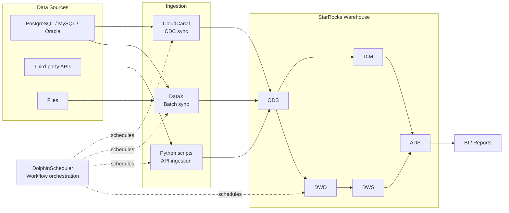

# DW Platform

> **English summary:** DW Platform is an early-preview reference scaffold for building a
> StarRocks-based analytics warehouse. It documents layered warehouse conventions and
> provides Python and Shell entry points for CDC, batch sync, API ingestion, and scheduled
> ETL workflows with DolphinScheduler integration in mind.

DW Platform 是一个面向数据工程实践的 StarRocks 数仓项目骨架，用于沉淀实时同步、批量同步、API
采集、分层建模和调度接入的约定与可扩展入口。

## Status

当前版本为 **early preview**。仓库已经提供架构文档、配置模块、执行脚本、测试骨架和基础开发规范；
生产级数据源适配、StarRocks DDL、完整 ETL 示例和可直接启动的本地演示环境仍在 Roadmap 中。

需要注意：

- `scripts/etl/etl.py` 目前是 ETL 注册入口骨架，尚未注册生产任务。
- `scripts/api/fetch_marketing_data.py` 是 API 采集模板，默认地址为示例域名。
- `docker-compose.yml` 仍是待完善的本地环境草案。

## Architecture



## Use Cases

- 搭建 StarRocks 数仓时，复用 ODS、DIM、DWD、DWS、ADS 分层约定。
- 将支持 CDC 的业务库通过 CloudCanal 接入 ODS 层。
- 将批量数据源或文件通过 DataX 接入 ODS 层。
- 将第三方 API 数据采集任务纳入统一的 Python 和 Shell 执行入口。
- 为 DolphinScheduler 工作流组织数据同步、ETL 和 BI 刷新依赖。
- 作为数据工程团队内部规范、样例和自动化脚本的起点。

## Core Capabilities

| Capability | Current state |
| --- | --- |
| StarRocks connection configuration | Available |
| Layered warehouse naming conventions | Available |
| Shell entry points for scheduled jobs | Available |
| API ingestion template with retry handling | Available |
| CloudCanal and DataX integration documentation | Available |
| ETL task registry and production examples | Planned |
| StarRocks table DDL examples | Planned |
| DolphinScheduler workflow sample | Planned |
| Local demo environment | Planned |

## Tech Stack

| Area | Component |
| --- | --- |
| OLAP warehouse | StarRocks |
| Workflow orchestration | DolphinScheduler |
| Real-time sync | CloudCanal |
| Batch sync | DataX |
| API ingestion | Python |
| BI integration | BI tools such as 永洪BI |
| Development environment | Python 3.12, Shell, Conda |

## Warehouse Layers

| Layer | Purpose | Naming convention |
| --- | --- | --- |
| ODS | 贴源层，保留原始数据 | `ods_{source}_{table}` |
| DIM | 维度层，维护公共维度 | `dim_{dimension}` |
| DWD | 明细层，清洗和标准化 | `dwd_{domain}_{entity}` |
| DWS | 汇总层，沉淀轻度聚合 | `dws_{domain}_{aggregate}` |
| ADS | 应用层，面向报表和指标 | `ads_{business}_{metric}` |

## Project Structure

```text
dw-platform/
├── config/          # 环境变量和配置模块
├── scripts/
│   ├── api/         # API 数据采集模板
│   ├── etl/         # ETL 注册入口
│   └── utils/       # 数据库等公共工具
├── datax/           # DataX 配置目录
├── cloudcanal/      # CloudCanal 文档
├── shell/           # DolphinScheduler 可调用的 Shell 入口
├── docs/            # 架构、建模、同步和运维文档
├── tests/           # 单元测试
└── requirements.txt # Python 依赖
```

## Quick Start

```bash
git clone https://github.com/zzhang1990/dw-platform.git
cd dw-platform

python -m venv .venv
source .venv/bin/activate
pip install -r requirements.txt

cp .env.example .env
python scripts/etl/etl.py --dt 2024-01-01 --layer all
```

DolphinScheduler 可调用 Shell 入口：

```bash
bash shell/run_etl.sh 2024-01-01 all
bash shell/run_api.sh fetch_marketing_data.py --dt 2024-01-01
```

API 采集脚本当前是模板。执行前请将示例地址替换为真实数据源，并实现目标表写入逻辑。

## Documentation

- [Architecture overview](docs/architecture/overview.md)
- [Data flow](docs/architecture/data-flow.md)
- [Technology stack](docs/architecture/tech-stack.md)
- [Modeling layer specification](docs/modeling/layer-spec.md)
- [ETL development guide](docs/ETL_GUIDE.md)
- [Deployment notes](docs/ops/deployment.md)

## Roadmap

Roadmap 工作通过 [GitHub Issues](https://github.com/zzhang1990/dw-platform/issues) 持续维护：

- Add StarRocks table DDL examples.
- Add a DolphinScheduler workflow sample.
- Add a DataX sync configuration example.
- Add a CloudCanal CDC setup walkthrough.
- Add a finance subject ETL sample pipeline.
- Add data quality validation checks.
- Add CI workflow for linting and tests.
- Replace Docker Compose placeholders with a local demo environment.

## Contributing

欢迎通过 Issue 和 Pull Request 参与。提交前请阅读 [CONTRIBUTING.md](CONTRIBUTING.md)。

## License

This project is licensed under the [MIT License](LICENSE).
